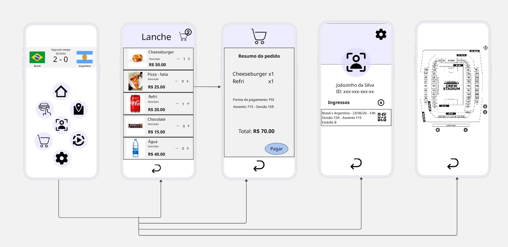

# ihcux-copa-2026

Nome do aluno: Vinicius Amaral Lazaroti

# Problema focado

A FIFA identificou que as maiores reclamações dos torcedores nos estádios são: filas imensas nos quiosques de comida, dificuldade de encontrar o portão correto e perda de lances importantes enquanto estão fora do assento. Para resolver isso, será criado o app "CopaNaMão", exclusivo para quem está dentro do estádio. O aplicativo permitirá que usuários:
1. Mapa Interativo: Localize seu assento, banheiros e portões via GPS.
2. Food Delivery/Pickup: Peça comida pelo app e receba um aviso para retirar quando estiver pronto (ou receba no assento).
3. Replay Multicâmera: Assista a replays de lances polêmicos de diferentes ângulos em tempo real.
4. Estatísticas ao Vivo: Dados dos jogadores que estão em campo no momento.

# Justificativa de design

As informações foram organizadas desta maneira por ser mais simples e intuitivo para o usuário.

# Fluxo do usuário

    

